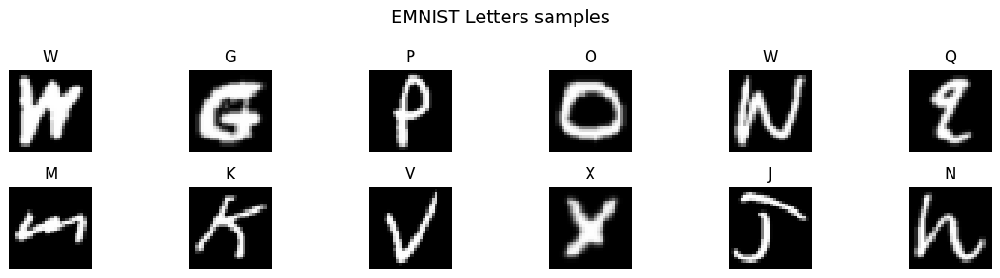
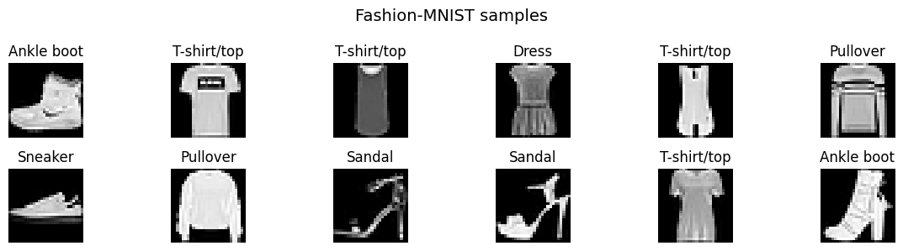
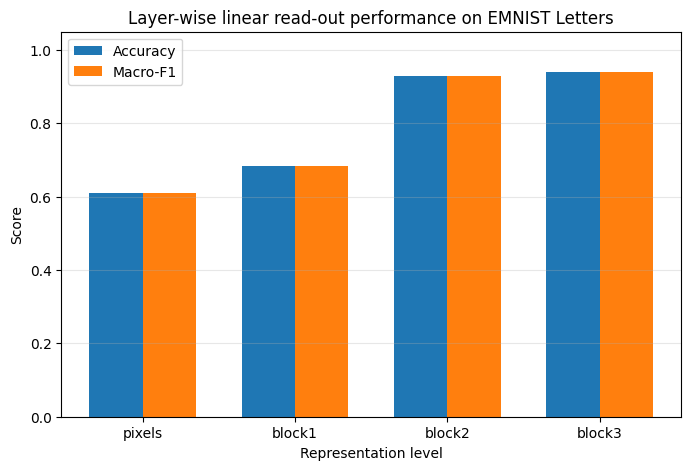
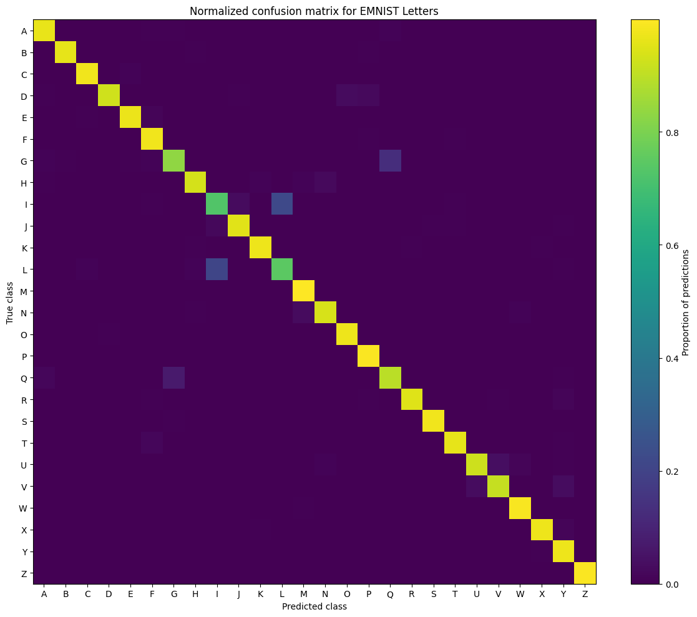
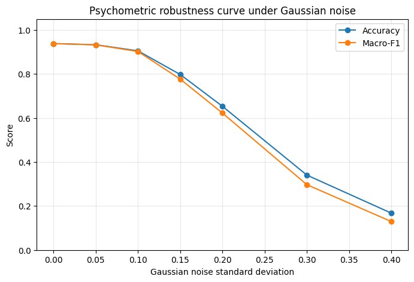

# Visual Concept Learning Across Symbolic and Object-Like Categories

This project investigates how convolutional neural networks learn visual concepts and develop internal representations across different types of visual categories.

Using **EMNIST Letters** and **Fashion-MNIST**, the project studies not only classification performance, but also the structure, robustness, and interpretability of the learned representations.

The analysis includes linear read-outs, hierarchical clustering, feature visualization, confusion matrices, psychometric curves under noise, and adversarial robustness experiments.

---

## Project Overview

The goal of this project is to understand how visual representations evolve across the hierarchy of a neural network.

In particular, the project addresses the following questions:

- Do deeper layers develop more linearly separable representations?
- Does the geometry of internal representations reflect similarity between visual categories?
- Are classification errors random, or do they follow meaningful visual patterns?
- How robust are learned concepts to noise and adversarial perturbations?
- Can adversarial fine-tuning improve model robustness?

---

## Datasets

Two image-classification datasets are used:

| Dataset | Description | Classes |
|---|---|---:|
| EMNIST Letters | Handwritten alphabetic characters | 26 |
| Fashion-MNIST | Clothing and object-like visual categories | 10 |

EMNIST Letters is used as the main dataset because it provides symbolic visual categories.  
Fashion-MNIST is used as a secondary validation dataset to compare performance on more object-like categories.

---

## Methods

The project uses a compact convolutional neural network trained for visual classification.  
After training, the model is analyzed using several complementary methods.

### 1. Model Training

A convolutional neural network is trained and evaluated using separate training, validation, and test sets.  
Several model configurations are compared to select a suitable architecture.

### 2. Linear Read-Out Analysis

Linear classifiers are trained on representations extracted from different levels of the model hierarchy:

- raw pixels
- early convolutional layer
- intermediate convolutional layer
- deeper convolutional layer

This analysis tests whether deeper layers produce more disentangled and linearly separable visual representations.

### 3. Representation Geometry

Internal representations are analyzed using:

- representational similarity matrices
- hierarchical clustering
- silhouette scores

This allows the project to examine whether the model organizes categories according to meaningful visual similarity.

### 4. Feature and Activation Visualization

The project visualizes:

- first-layer convolutional filters
- internal activation maps

These visualizations help interpret what kinds of low-level and intermediate features are learned by the network.

### 5. Error Analysis

Confusion matrices are used to study classification errors and identify which categories are most frequently confused.

This helps determine whether errors are structured by visual similarity rather than being random.

### 6. Psychometric Curves

The model is tested under increasing levels of Gaussian noise.

Accuracy is measured as noise increases, producing psychometric curves that show how performance degrades under progressively harder visual conditions.

### 7. Adversarial Robustness

The project investigates model sensitivity to adversarial perturbations using FGSM-style attacks.

A compact adversarial fine-tuning experiment is also included to evaluate whether robustness can be improved.

---

## Main Results

The experiments show that deeper layers produce more linearly separable representations than raw pixels and early features.

In the main EMNIST Letters experiment, linear read-out accuracy improves substantially across the model hierarchy:

| Representation Level | Approximate Read-Out Accuracy |
|---|---:|
| Raw pixels | 0.61 |
| Early convolutional layer | 0.68 |
| Intermediate convolutional layer | 0.93 |
| Deep convolutional layer | 0.94 |

This supports the idea that hierarchical neural networks progressively transform visual inputs into more abstract and disentangled representations.

The confusion matrix analysis shows that many errors occur between visually similar letters.  
The psychometric curves show a gradual decrease in accuracy as input noise increases.  
The adversarial experiments show that the model is sensitive to small perturbations, although adversarial fine-tuning improves robustness to some extent.

---

## Selected Visual Results

### EMNIST Letter Samples



### Fashion-MNIST Samples



### Layer-Wise Linear Read-Out Performance



### EMNIST Confusion Matrix



### Psychometric Curve Under Gaussian Noise



### Adversarial Robustness Under FGSM Attack


---

## Repository Structure

```text
visual-concept-learning/
│
├── README.md
├── visual_concept_learning.ipynb
├── requirements.txt
├── .gitignore
└── figures/
    ├── emnist_samples.png
    ├── fashion_mnist_samples.png
    ├── linear_readout_performance.png
    ├── confusion_matrix_emnist.png
    ├── psychometric_curve_noise.png
    └── adversarial_robustness_curve.png
---

## Key Skills Demonstrated

- Deep learning for image classification
- Convolutional neural networks
- Representation learning
- Linear probing / linear read-out analysis
- Hierarchical clustering
- Confusion matrix analysis
- Psychometric curve generation
- Adversarial attack analysis
- Model robustness evaluation
- Scientific visualization
- Experimental reporting in Python notebooks

```
---

## Conclusion

This project shows that classification accuracy alone is not sufficient to understand visual concept learning.

By combining linear read-outs, representation geometry, clustering, feature visualization, error analysis, noise robustness, and adversarial testing, the project provides a broader analysis of how neural networks learn and organize visual categories.

The results support the view that deeper neural network layers create more abstract and linearly separable representations, while also showing that these representations can remain sensitive to noise and adversarial perturbations.
